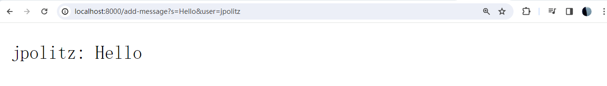
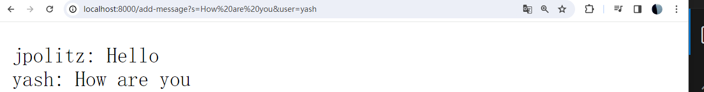

# Lab Report 2

## Part 1

The code of ChatServer is shown below

```
import java.io.IOException;
import java.net.URI;

public class ChatServer implements URLHandler {

    private StringBuilder chatHistory = new StringBuilder();

    public static void main(String[] args) throws IOException {
        int port = 8000; 
        ChatServer chatServer = new ChatServer();
        Server.start(port, chatServer);
    }

    @Override
    public String handleRequest(URI url) {
        if ("/add-message".equals(url.getPath())) {
            String[] params = parseQuery(url.getQuery());
            String message = params[0];
            String user = params[1];

            chatHistory.append(user).append(": ").append(message).append("\n");
            return chatHistory.toString();
        }
        return "Invalid request";
    }

   
    private String[] parseQuery(String query) {
        String[] params = new String[2]; 
        if (query != null) {
            String[] parts = query.split("&");
            params[0] = parts[0].substring(parts[0].indexOf('=') + 1);
            params[1] = parts[1].substring(parts[1].indexOf('=') + 1);
        }
        return params;
    }
}
```

a) For the input /add-message?s=Hello&user=jpolitz
    The output is shown below. 
    
The **Main, handleRequest, pareQuery** methods were called, for the **Main** method, *String[] args*  which is the command-line argument, and the relevant field *chatHistory* has no change. 
For the  **handleRequest** method, the relevant argument is *String query*, and the filed *chatHistory* changes when it's appending new messages, for this input, it changes to "jpolitz: Hello\n". 
For the **pareQuery** method, the relevant argument is *String query*, for this input the argument is "s=Hello&user=jpolitz". 

b) For the input /add-message?s=How are you&user=yash
    The output is shown below.
     
The **handleRequest, pareQuery** methods were called, for the **handleRequest** method, the relevant argument is *URI url*, which is ("/add-message?s=How are you&user=yash"), and the relevant field *chatHistory* changes from *"jpolitz: Hello\n"* to *"jpolitz: Hello\nyash: How are you\n"*.  
For the **pareQuery** method, the relevant argument is *String query*, for this input the argument is "s=How are you&user=yash". 

## Part 2 

    
