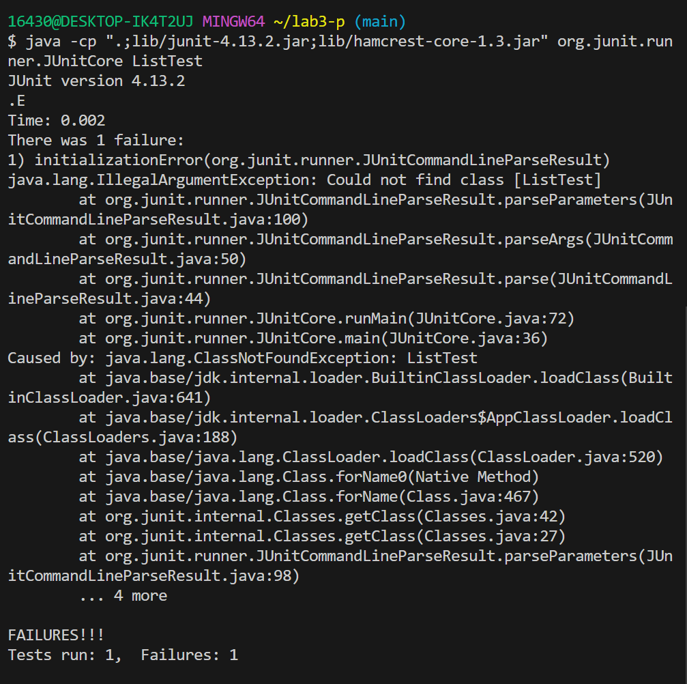

# Lab Report 3

## Part 1 - Bugs

### Failure-inducing input 
```
import static org.junit.Assert.*;
import org.junit.*;
public class ListTests {
    @Test
    public void testFilter_ReverseOrder() {
        List<String> input = Arrays.asList("a", "b", "c");
        List<String> expected = Arrays.asList("a", "b", "c"); // Expecting original order
        assertEquals(expected, ListExamples.filter(input, s -> true));
    }
}
```
### Symptom



### Correct input 
```
import static org.junit.Assert.*;
import org.junit.*;
public class ListTests {
    @Test
    public void testFilter_ReverseOrder() {
        List<String> input = Arrays.asList("a", "a", "a");
        List<String> expected = Arrays.asList("a", "a", "a");
        assertEquals(expected, ListExamples.filter(input, s -> true));
    }
}
```

### Symptom


### The Bug- Before 
```
class ListExamples {
  static List<String> filter(List<String> list, StringChecker sc) {
    List<String> result = new ArrayList<>();
    for(String s: list) {
      if(sc.checkString(s)) {
        result.add(0, s);
      }
    }
    return result;
  }
```
### Fix 
```
class ListExamples {
  static List<String> filter(List<String> list, StringChecker sc) {
    List<String> result = new ArrayList<>();
    for(String s: list) {
      if(sc.checkString(s)) {
        result.add(s);
      }
    }
    return result;
  }
```
By changing result.add(0, s) to result.add(s), the elements that pass the StringChecker's condition are added in the order they appear in the input list, which fixes the bug related to unintended order reversal.

## Part 2  Researching Commands -- grep 
***The following commands are from the website https://docs.rackspace.com/docs/use-the-linux-grep-command***
### 1. -i: Prints lines with matching criteria while ignoring casing 

```
$ grep -i "static" ListExamples.java
  static List<String> filter(List<String> list, StringChecker sc) {
  static List<String> merge(List<String> list1, List<String> list2) {
```
  Search for the word "static" in ListExamples.java, ignoring the case. This option makes the search case-insensitive, allowing grep to match a string regardless of its case.

```
$ grep -i "if" ListExamples.java
      if(sc.checkString(s)) {
      if(list1.get(index1).compareTo(list2.get(index2)) < 0) {
```
  Search for the word "if" in ListExamples.java, ignoring the case. This option makes the search case-insensitive, allowing grep to match a string regardless of its case.

### 2. -v:  Prints lines not matching criteria (inverse search).

```
$ grep -v "int" ListExamples.java
import java.util.ArrayList;
import java.util.List;
```
  For conciseness, I shortened the result,  the command displays all lines in ListExamples.java that do not contain the word "int". This option inverts the match, showing only the lines that do not match the given pattern.

```
$ grep -v "result " ListExamples.java
import java.util.ArrayList;
import java.util.List;
```
  For conciseness, I shortened the result. I found out that the command is space-sensitive, if we add a space before or after the  searching word, it does invert the match. 

### 3. -n: Prints lines with matching criteria and line numbers.

```
$ grep -n "if" ListExamples.java
14:      if(sc.checkString(s)) {
28:      if(list1.get(index1).compareTo(list2.get(index2)) < 0) {
```
  This command searches for "if" in ListExamples.java and displays line numbers. This option prefixes each line of output with the line number within its input file.

```
$ grep -n "static" ListExamples.java
11:  static List<String> filter(List<String> list, StringChecker sc) {
24:  static List<String> merge(List<String> list1, List<String> list2) {
```
  This command searches for "static" in ListExamples.java and displays line numbers. This option prefixes each line of output with the line number within its input file.

### 4. -w: Prints whole word matches.

```
$ grep -w "return result" ListExamples.java
    return result;
    return result;
```
  This command searches for the word "return result" as a whole word in ListExamples.java.

```
$ grep -w "return " ListExamples.java
```
 This command searches for the word "return " as a whole word in ListExamples.java. but it will not match the "return result". 


