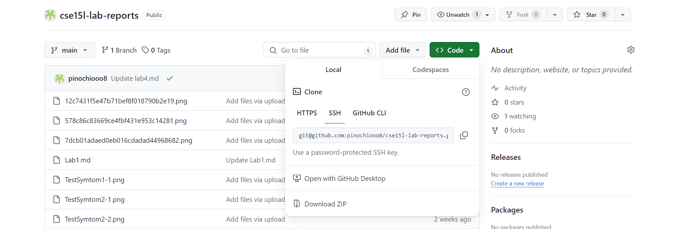

# Lab Report 4

## 1. Setup Delete any existing forks of the repository you have on your account

## 2. Setup Fork the repository

## 3. The real deal Start the timer!

## 4. Log into ieng6
  Enter the code `ssh rucao@ieng6.ucsd.edu` in the terminal to log into ieng6 and press <enter>
  
  

## 5. Clone your fork of the repository from your GitHub account (using the SSH URL)
  Copy and paste the SSH URL from my GitHub account. 
  Keystrokes using  : left click copy button here, and go to terminal in vs code press `ctrl + v enter`.
  
  
  
## 6. Run the tests, demonstrating that they fail
  Type in `<ls><enter>` to see the list of files under the repository, and type `<cat test.sh>` to view the content file. `<command+C>` to copy the `javac -cp .:lib/hamcrest-core-1.3.jar:lib/junit-4.13.2.jar *.java` command, 
  `<command+v>` to paste command and hit `<enter>`. `<command+C>` to copy the `java -cp .:lib/hamcrest-core-1.3.jar:lib/junit-4.13.2.jar org.junit.runner.JUnitCore ...` command and  `<command+v>` to paste the command and hit `<enter>`. 
  
  

## 7. Edit the code file to fix the failing test
  Type in `vim ListExample.java` to edit the file. 
  Press `<SHIFT + G>` to Move me to the bottom of the file, Press`<k><k><k><k><k><k>` move me to the line that needs to be edited, `<control + A>` gets me to the start of the line, press `<dw>` to delete the integer 1, press `<i> <2> <space>`to 
  add an integer 2 and hit `<esc>` to quit the insert mode. press `<:wq>` to save and exit vim. 
  
  

## 8. Run the tests, demonstrating that they now succeed
  Keys pressed: `<up><up><up><enter>`, `<up><up><enter>` The `javac -cp .:lib/hamcrest-core-1.3.jar:lib/junit-4.13.2.jar *.java` command was 3 up in the search history, so I used up arrow to access it. 
  Then the `java -cp .:lib/hamcrest-core-1.3.jar:lib/junit-4.13.2.jar org.junit.runner.JUnitCore ...` command was 2 up in the history, so I accessed and ran it in the same way.
  
  

## 9. Commit and push the resulting change to your GitHub account (you can pick any commit message!)
  Use git commit and git add to push the resulting change to the remote repository. 
  
  
## Summary 

### Commands: 
   1. git clone: Clone my fork of the repository from my GitHub account.
   2. ls: show the list of files under the current directory.
   3. vim: to open the vim editor.
   4. cat: show the content of the input file.
   5. javac, java: compile and run the java file.
   6. git commit: records changes to the repository, capturing the current state of the tracked files.
   7. git add: stages changes in files to be included in the next commit, allowing you to select specific modifications to commit.
   8. git push: push my commits to the remote repository associated with my current branch.

### Keypresses:
  #### Step 1-3
  
  #### Step 4 
  `ssh rucao@ieng6.ucsd.edu` and hit `enter`, `ssh`  initiates a secure connection to the server ieng6, rucao is my username for ieng6.
  
  #### Step 5 
  Copy the SSH URL on GitHub press `git clone + ctrl + v`  and press `enter` in the vs code terminal, Git will start the cloning process, creating a local directory named after the lab7, the `ctrl + v` will paste the ssh from Github.
  
  #### Step 6 
  Press `ls` to view the list of files under lab7, and type in `cat test.sh + enter` to view the contents of the file named test.sh on the terminal screen. Use `ctrl +c` to copy and `ctrl + v` to paste the command `javac -cp .:lib/hamcrest-core-1.3.jar:lib/junit-4.13.2.jar *.java + enter`  and `to compile all Java source files in the current directory.  Use `ctrl +c` to copy and `ctrl + v` to paste the command `java -cp .:lib/hamcrest-core-1.3.jar:lib/junit-4.13.2.jar org.junit.runner.JUnitCore ... + enter` to execute JUnit tests from the command line.
  
  #### Step 7: 
  Press `vim ListExample.java` to open the ListExample.java file in Vim, a configurable text editor. Now in the Vim editor, press `SHIFT + G` to Move to the bottom line of the ListExample.java, then press `k` five times, `k` is used to move the cursor up one line, in this case, press `k` five times move me 5 lines upper to get to the line needs to be edited. Then press `control + A` to move to the start of the line, and press `dw` to delete the word which is **1** currently under the cursor, up to the beginning of the next word. Press `<i> <2> <space>` here, command `i` switch the mode to insert mode, `2` inserts an inter 2 at the current cursor location, and the `space` button inserts a space character at the current cursor location. press `ESC` to quit the insert mode. At the end, press `:wq` to save and exit the vim editor. 
  
  #### Step 8 
  Press `<up><up><up><enter>`, `<up><up><enter>` here to find the `javac -cp .:lib/hamcrest-core-1.3.jar:lib/junit-4.13.2.jar *.java + enter` command and `java -cp .:lib/hamcrest-core-1.3.jar:lib/junit-4.13.2.jar org.junit.runner.JUnitCore ... + enter` command, in the search history. The purpose is to re-compile the ListExamples.java file and re-run the Junit tests.
  
  #### Step 9 
  Press `git add ListExamples.java + enter`, to mark the current state of `ListExamples.java` to be included in the next commit, allowing Git to track changes to this file. Then press `git commit -m "ListExmaples" + enter` create a new commit in the Git version control system, capturing the current state of `ListExamples.java` that has been staged with git add. At the end, press `git push + enter` to upload the local repository content to the remote.
  

   1. <command+C>,<command+v> : copy and paste.
   2. <SHIFT + G>: Under Vim, Move to the bottom of the file.
   3. <control + A>: Under Vim, Move to the start of the line
   4. dw: under vim, delete.
   5. i: under vim, insert.
   6. <:wq>: under vim, save and exit vim.
   7. esc: Under Vim, in this particular lab the function is to exit the insert mode. 
